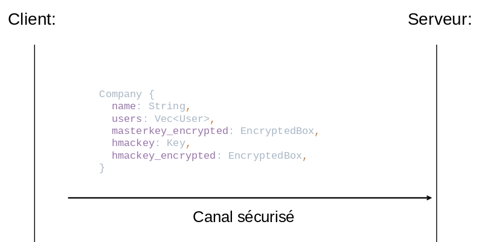

# Rust Secure Cloud
*Projet développé lors du cours de Cryptographie Appliquée*

**Logiciel de stockage de fichiers chiffré utilisant l'algorithme "Shamir Secret Sharing"**


## Architecture générale

Pour ce projet j’ai fait une architecture Client-Serveur, avec deux programmes séparés.

La communication entre les deux se fait via un canal TCP surtout pour des raisons de facilité de développement.

### Client

Comme on veut que les employés de l’entreprise puissent accéder à leurs données depuis n’importe quel appareil, il est impératif que l’application client ne stocke aucune donnée mais que tout soit stocké côté serveur

### Serveur

Le serveur ne peut pas lire les données car tout a déjà été chiffré côté client. Le serveur n’a accès qu’aux noms d’entreprises et d’utilisateur.

## Choix de technologies

J’ai choisi de faire ce projet en Rust bien que ce language soit plus moderne que le C/C++ et donc moins mature, son aspect de “sécurité par défaut” me paraît essentiel pour une application sensible comme celle-ci.

Pour le choix de la bibliothèque, il nous a été proposé d’utiliser un des Crates suivant basés sur *********[libsodium](https://libsodium.gitbook.io/doc/)*********: 

- *sodiumoxyde*
- *dryoc*

Après quelques recherches on peut voir que ****sodium-oxyde**** est [dépressié](https://github.com/sodiumoxide/sodiumoxide). J’ai donc utilisé *******dryoc******* qui est très similaire et en plus est écrit en pur Rust.

Pour l’implémentation du shamir secret sharing, il existe beaucoup de crates différents 

- `shamir`
- `sharks`
- `vsss-rs`
- `shamirsecretsharing`
- …

J’utilise le crate `[shamirsecretsharing](https://github.com/dsprenkels/sss-rs)` car il est le plus simple à utiliser et il permet de définir un seuil de shards qui est différent du nombre total de shards créés. De plus le crate est en pur Rust.

 Dans la théorie il faudrait utiliser un crate qui a été audité pour garantir une meilleure sécurité

## Différents processus

### Création de compte

*On part du principe que la création de compte se passe dans un contexte sécurisé où personne ne peut ni écouter ni intercepter les communication entre le client et le serveur*

Du côté client, je crée d’abord les utilisateurs, pour cela, j’ai créé le tableau de 64 bytes : **grouped_shards** à partir duquel je génère mes shards pour le shamir secret sharing (en utilisant le crate mentionné plus tôt). Je définis un seuil de 2 mots de passe nécéssaires pour retrouver le secret.

Ensuite, un mot de passe et un nom d’utilisateur sont demandés.

Le mot de passe utilisé doit faire entre 12 et 64 caractères et doit avoir un score d’au moins 3 (selon la librairie zxcvbn-rs) c’est à dire une bonne entropie ([plus de détails sur le calcul du score](https://security.stackexchange.com/questions/180115/how-to-convert-zxcvbn-entropy-to-score))

Chaque utilisateur a un nom, un sel généré aléatoirement et un shard chiffré, par une clé générée à partir du mot de passe et du sel généré.

La **groupKey** pourra être générée en hashant les **grouped_shards**.

Structure `User`

```rust
struct User {
    username: String,
    encrypted_shard: EncryptedBox,
    salt: Salt // [u8; 16]
}
```

→ Il n’y a pas besoin de stocker le hash du mot de passe car celui-ci est vérifié lors du déchiffrement du shard.

Ensuite on génère une `Company`, elle possède :

- un **nom** : entré par l’utilisateur (accepte les caractères UTF-8)
- un vecteur d’**utilisateurs**
- une **masterKey** : générée aléatoirement  et fait une taille de 32bytes (Le RNG utilise celui de l’OS)
    
    ⇒ Utilisée dans le chiffrement des clés envoyées sur le serveur
    
- hmacKey : pareil que la masterKey
    
    ⇒ Utilisée pour authentifier les connexions
    

La **masterKey** et la **hmacKey** sont ensuite chiffrées avec la **groupKey**, qui est le hash des **grouped_shards.**

⚠️ la **groupKey** n’est pas enregistrée dans la `Company`

Structure `Company`

```rust
struct Company {
    name: String,
    users: Vec<User>,
    masterkey_encrypted: EncryptedBox,
    hmackey: Key, // [u8; 32]
    hmackey_encrypted: EncryptedBox,
}
```

Ensuite le Client envoie la companie au serveur (après l’avoir sérialisée (avec le Crate Serde) et encodée (avec le Crate Bincode)



### Authentification d’une session

On authentifie chaque session entre le client et le serveur pour s’assurer que le client est bien celui qu’il indique être


Pour faire cela on régénère la GroupKey à partir des shards:

1. Le client envoie le nom de l’entreprise ainsi que 2 noms d’utilisateurs
2. L’entreprise renvoit 
    - les shards chiffrés des utilisateurs correspondants
    - un nombre aléatoire r
    - la HMacKey chiffrée
3. Le client reconstruit la GroupKey
    - Il génère le `grouped_shards` (avec shamir) à partir des mots de passe dérivés (avec Argon2)
    - Il reconstruit la `groupKey` en hashant le `grouped_shards` (Blake2b)
4. Le client déchiffre la HMacKey avec la GroupKey
5. Il calcule le MAC (HMAC-SHA512-256) du nombre aléatoire
6. Le Client envoie le MAC
7. Le serveur calcule le MAC à partir de sa HMacKey stockée en clair
8. Il compare le résultat
9. S’ils correspondent, le serveur envoie la `MasterKey` chiffrée au Client
10. Le client déchiffre la `MasterKey` avec sa `GroupKey` (qui a été reconstruite à partir de 2 mots de passe entrés par 2 utilisateurs).

### Rekey

*On part du principe que le rekey se passe dans un contexte sécurisé (comme la création de compte)*

En cas de changement de comptes utilisateurs, pour ne pas devoir tout télécharger les données pour les rechiffrer individuellement, j’utilise une clé intermédiaire: la `group_key`.

Pour faire le rekey il ne me suffit seulement de regénérer mes utilisateurs et ma `group_key` et de rechiffrer la `masterKey` avec celle-ci.

Ensuite l’entreprise est renvoyée au serveur comme pour la création de compte.

### Upload d’un fichier

→ chaque fichier est chiffré avec une `file_key` pour ne pas avoir à tout rechiffrer et garder les autres fichiers secrets en cas de fuite d’un clé.


1. Avant l’upload d’un fichier, il faut que le client soit authentifié
2. Il génère aléatoirement une `file_key` (OSRNG)
3. Le client choisi un fichier
4. Il chiffre
    - le fichier avec la `file_key`
    - la `file_key` avec la `masterKey`
    - le `file_name` avec la `masterKey`
5. Il envoie les données au serveur
6. Le serveur enregistre ces données dans des fichiers (la hiérarchie des fichiers est expliquée plus tard)

### Téléchargement d’un fichier


Le téléchargement de fichier se fait en trois étapes:

- Le client reçoit la liste des noms de fichiers (avec leur UUID correspondant) et choisit celui qu’il veut télécharger
    
    → Chaque nom de fichier est déchiffré avec la **masterKey**
    
- Ensuite, le serveur reçoit le UUID du fichier que le client veut et le lui renvoie
- En fin, le client déchiffre le fichier et le sauvegarde

## Fuite de la masterKey

Théoriquement, en cas de fuite de la masterKey, il faudrait: 

- Télécharger tous les fichiers manuellement
- Supprimer l’entreprise (pas implémenté)
- Recréer une entreprise
- Réuploader les fichiers

## Résumé des données qui transitent entre le client et le serveur

************Les crochets indiquent que la donnée est chiffrée************

**Sur un canal sécurisé**

- $company\ \{\ name,\ users,\ [masterKey],\ hmacKey,\ [hmacKey]\ \}$

→ La hmacKey transite en clair c’est pour cela que nous avons besoin d’un canal sécurisé

**Sur un canal non sécurisé**

- $companyName$
- $userNames$
- $user\ \{\ userName,\ sel,\ [shard]\ \}$
- $random$
- $[hmacKey]$
- $[masterKey]$
- $[filename]$
- $[fileKey]$
- $[file]$

→ Les seules données qui transitent en clair sont les noms d’entreprises, les noms d’utilisateurs (on part du principe que ce sont des pseudonymes) ainsi que des valeurs aléatoires

Un attaquant passif ne peut rien faire avec ces informations, aucune clé, fichier ou nom de fichier ne transite en clair.

Masquer le nom d’entreprise serait peu utile puisque si un attaquant veut vérifier qu’une entreprise est enregistrée il n’a qu’a essayer de créer lui-même la même entreprise et il obtiendra une erreur.

## Structure de fichiers

Pour la structure des fichiers côté serveur, un dossier par entreprise est créé lors de l’étape de la création d’entreprise

Le nom de l’entreprise est converti en ASCII en remplaçant les `/` et espaces, si un nom d’entreprise existe déjà alors la création est interrompue et une erreur est retournée au client.

*Toutes les données des fichiers sont encodées en binaire avec l’aide du crate [bincode](https://github.com/bincode-org/bincode) qui plus adapté que du json ou yaml pour des tableaux de bytes.*

*Les structures de donnée Rust sont d’abord sérialisées avec l’aide de [Serde](https://github.com/serde-rs/serde)* 

Le dossier de l’entreprise contient:

- un fichier `data.bin` qui contient les données de l’entreprise :
    
    ```rust
    Company {
        name: String,
        users: Vec<User>,
        masterkey_encrypted: EncryptedBox,
        hmackey: Key, // [u8; 32]
        hmackey_encrypted: EncryptedBox,
    }
    ```
    
- un dossier files qui contient deux fichiers pour chaque document uploadé par le client
    - les fichiers `.data` contiennent les données chiffrées
    - les fichiers `.key` sont les clés des fichiers, elle-même chiffrées
    

Exemple:


## Composantes cryptographiques

Pour les composantes cryptographiques je me suis basé sur ce que proposait [libsodium](https://libsodium.gitbook.io/doc/) (donc dryoc) en sachant que la lib avait été auditée (bien qu’il aurait été encore mieux que dryoc le soit aussi)

Algorithmes utilisés:

- Chiffrement des clés et des données (Structures `EncryptedBox`): **XSalsa20-Poly1305**
- Génération des `grouped_shards` : **Shamir avec GF(2^8)**
- Hash des `grouped_shards` pour générer la `group_key`: **BLAKE2b**
- Dérivation de clé depuis un mot de passe : ************Argon2 avec sel************
- Calcul du MAC : **HMAC-SHA512-256**
- Génération aléatoire des clés et du sel **: OS-RNG**

Tailles:

- Toutes les clés ont des tailles de 32bytes (protection long-terme)
    
    ⇒ Cycle de vie de clés : théoriquement il faudrait faire du renouvellement de clé
    
- Le sel a une taille de 16bytes (imposé par Dryoc)

## A rajouter si j’avais eu plus de temps pour faire ce projet

Si j’avais eu plus de temps à disposition j’aurais ajouté les fonctionnalités suivantes:

- Une création de compte / rekey avec un canal sécurisé (ex: TLS)
- Remplacer le canal TCP par de l’HTTP(S).
- Compression des fichiers avant l’envoi sur le serveur
- Suppression des fichiers
- Suppression d’entreprises